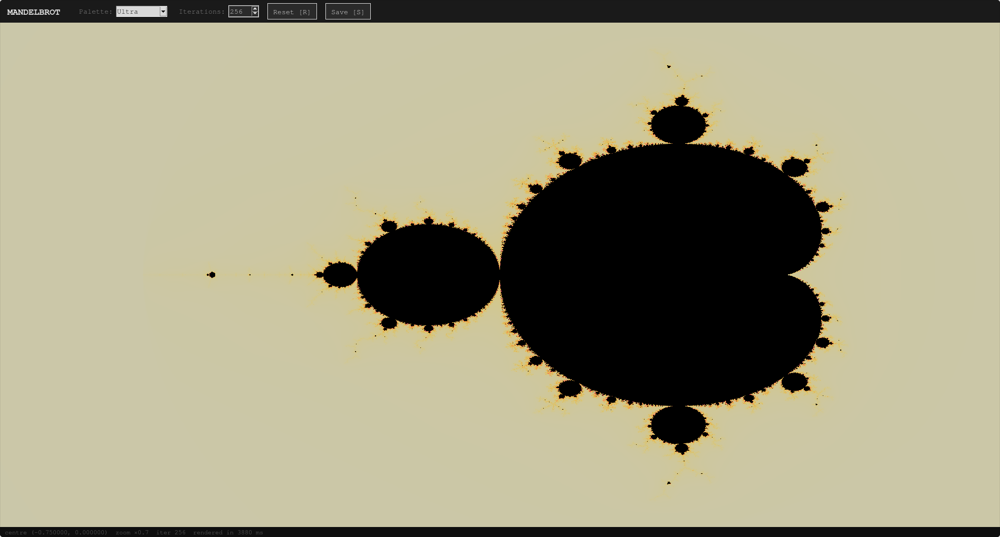
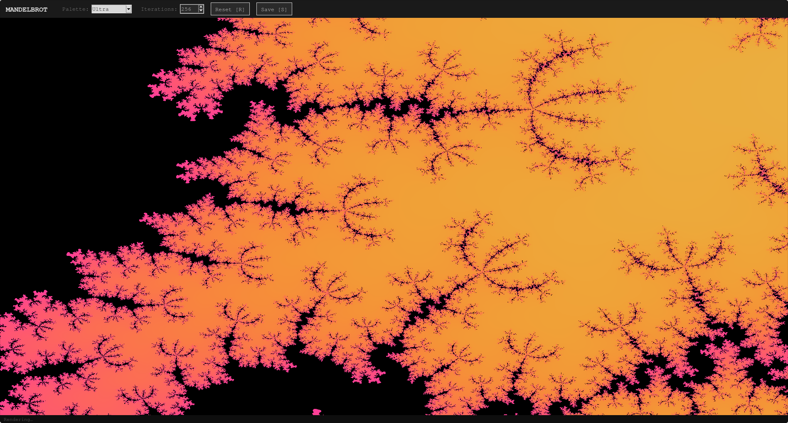

# Mandelbrot Viewer

An interactive Mandelbrot set explorer built in Python. Pan and zoom into the infinite fractal boundary with smooth colouring, multiple palettes, and real-time rendering powered by NumPy.



---

## Features

- **Smooth colouring** — escape-time algorithm with logarithmic smoothing eliminates harsh banding
- **6 colour palettes** — Ultra, Electric, Fire, Ocean, Pastel, Greyscale
- **Pan and zoom** — click-drag to pan, scroll wheel to zoom, double-click for a sharp zoom-in
- **Adjustable iterations** — trade speed for detail at deep zoom levels
- **Save PNG** — export the current view at full canvas resolution
- **Keyboard shortcuts** — for everything

---

## Screenshots

| Full view | Deep zoom |
|-----------|-----------|
|  |  |

---

## Requirements

- Python 3.8+
- [NumPy](https://numpy.org/)
- [Pillow](https://python-pillow.org/)
- tkinter (included with most Python distributions)

Install dependencies:

```bash
pip install numpy pillow
```

> **Linux users:** if tkinter is missing, install it via your package manager:
> ```bash
> sudo apt install python3-tk   # Debian/Ubuntu
> sudo dnf install python3-tkinter  # Fedora
> ```

---

## Usage

```bash
python mandelbrot_viewer.py
```

### Controls

| Action | Control |
|--------|---------|
| Pan | Click and drag |
| Zoom in/out | Scroll wheel |
| Zoom in at cursor | Double-click or right-click |
| Reset view | `R` |
| Save screenshot | `S` |
| Increase iterations | `+` / `=` |
| Decrease iterations | `-` |
| Switch palette | `1` – `6` |
| Quit | `Esc` |

---

## How it works

The Mandelbrot set is the set of complex numbers *c* for which the sequence

```
z₀ = 0
zₙ₊₁ = zₙ² + c
```

remains bounded. Points inside the set are coloured black; points outside are coloured by how quickly they escape to infinity, using the smooth iteration count:

```
ν = n − log₂(log₂|zₙ|)
```

where *n* is the escape iteration. This removes the hard boundaries between iteration bands. The renderer maps ν into a cyclic colour palette to produce smooth gradients.

The entire pixel grid is computed as a single NumPy operation — no Python loops over pixels — which keeps rendering interactive without needing a GPU.

---

## Interesting coordinates to explore

| Location | Centre | Zoom |
|----------|--------|------|
| Seahorse Valley | `(−0.7269, 0.1889)` | ×500 |
| Elephant Valley | `(0.3, 0.0)` | ×200 |
| Triple Spiral | `(−0.0877, 0.6543)` | ×2000 |
| Mini Mandelbrot | `(−1.7499, 0.0)` | ×1000 |

---

## License

MIT
